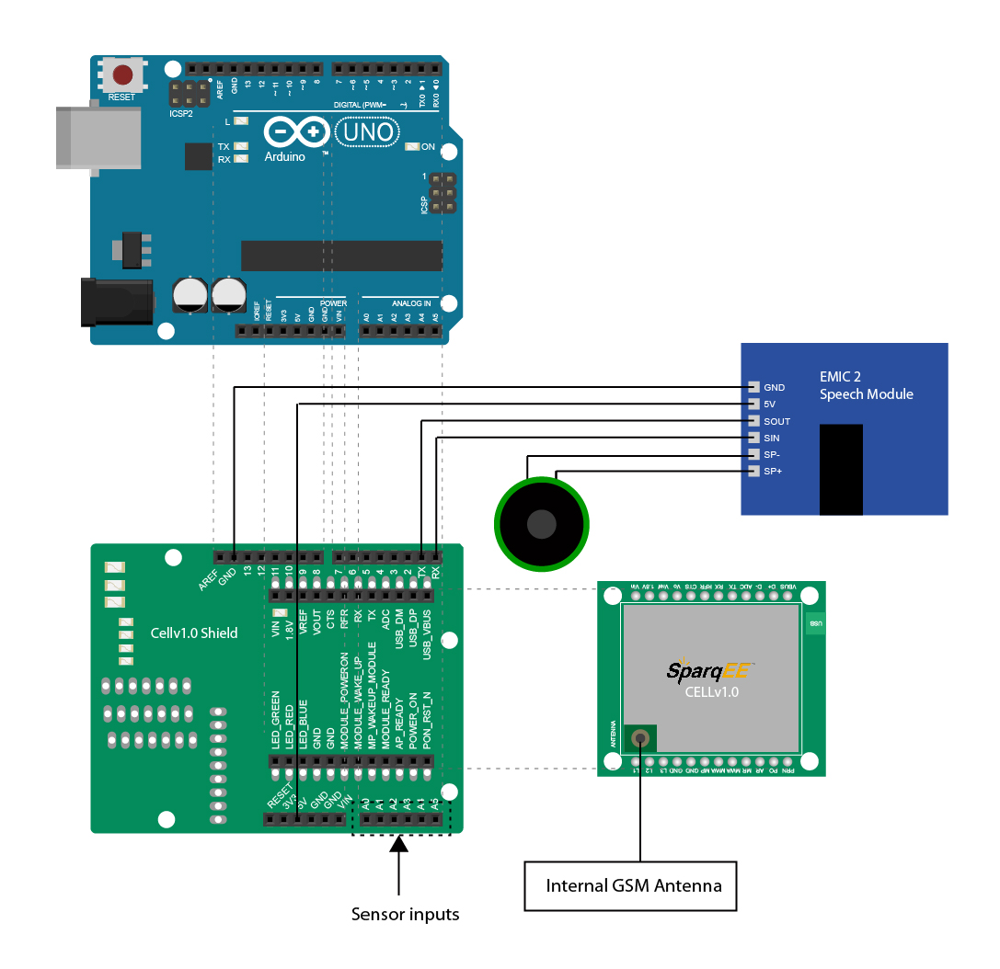

Super Fat: Furby Chat Client
============================

This repository is dedicated to the code for "Super Fat" Toy Project to be presented and exhibited at the Makerfaire NY on September 20-21, 2014. Contributions are super-appreciated and contributors will definitely be mentioned.

Project Description
-------------------

*Super Fat* is an speculative attempt to treat a toy object as a "fat" web chat client as opposed to the "thin" web client in the usual MVC paradigm. By being "fat" it simply means that more computing is moved into the client from the server or cloud, and by being "super fat" is actually making that computing physical.

Requirements
------------

+ [Node.js](http://nodejs.org) and [Socket.io](http://socket.io)
+ [Firebase](https://firebase.com "Firebase") for pushing and retrieving data remotely
+ [Arduino](http://arduino.cc/ "Arduino") for the toy's main microcontroller
+ [Cellv1.0](http://www.sparqee.com/portfolio/sparqee-cell/ "Sparqee Cellv1.0") for 3G communication

Instructions
------------

### Starting Chat App ###

Install [Node.js](http://nodejs.org/ "Node.js"), which should come with [Node Package Manager](https://www.npmjs.org/ "NPM"). Please install globally so you both `chatapp-socket.io` and `toy` can see it.

1. `cd chatapp-socket.io` 
2. `npm install` all dependencies from `package.json` 
3. run `node index.js`. The chat app should be on `http://localhost:8000`

####  Retrieving Remote Data ####

After running `node index.js`, from another terminal, run

```bash
curl https://blistering-inferno-6120.firebaseio.com/chatters.json
```

You should get back a JSON file containing the test users and messages on the server.

### Toy Circuit ###

#### Requirements ####

On the hardware side, we'll decidedly used 
+ [Cellv1.0](http://www.sparqee.com/portfolio/sparqee-cell/) for super-easy setup
+ [Cellv1.0 Arduino Shield](http://www.sparqee.com/portfolio/sparqee-shielda/) for no-brainer arduino integration with the above
+ [Internal 4G/3G/GSM Strip Antenna](http://microcontrollershop.com/product_info.php?products_id=6008) which should be small enough to incorporate into the toy
+ [EMIC 2](http://www.parallax.com/product/30016 "EMIC 2") from Parallax for text-to-speech capability to read the stream from the chat client. A bit costly but the features are rich and there are only so many pins!

Below is a rough sketch of what might be included. 



#### Retrieving Remote Data ####

**Upload Firmata and Node Dependencies**

Johny-five relies on Firmata library, so...

1. cd into `toy/`, open up `StandardFirmata.ino` with the Arduino IDE.
2. Connect your arduino board, select the right board and serial port.
3. Upload the code onto the board. Upon success, close the IDE. Firmata is successfully uploaded.
4. `cd toy/example` and install dependencies `npm install`. This will install Firebase and Johny-five. 

Now the arduino is ready for the following

**The (Furby) motor:**

2. `cd toy/img/motor` and use the diagram to connect a simple motor circuit.
3. `cd toy/example` and run `node motor.js`

Now, when you log into the chat client on port 8000, the motor will fire for every new message you type.

**The (Furby's tummy) push button:**

Furby's tummy button is simple SPST, Normally-open type. 

1. `cd toy/img/button` and use the diagram to connect a simple button circuit.
2. `cd toy/example` and run `node button.js`

When button is pressed, the chat room should be "hijacked" with a username "Furby" and message "GIGGGLE!"

---------------------------------------

Updates & Progress
------------------

**09/04/14:**
Just created simple data syncing with the Furby's motor and push button. The chat app is a bit hacked and broken, so I'll get into it today. Things like welcome message and numUsers can be omitted for simplicity (less things to break). [palaa159](https://github.com/palaa159 "Apon")suggested [Spark.io](http://spark.io/ "Spark board") instead of the arduino. It is so small, arduino-like and comes with its own RESTful cloud. We'll see tomorrow if it's painful to transfer.

**09/03/14:**
17 More days to go! I tested some example codes for [Johny-five](https://github.com/rwaldron/johnny-five "Johny-five") from [Anna Gerber's repo](https://github.com/AnnaGerber/node-ardx "Nodebot Experimenter Kit") and I was pleased to learn that it's very simple to get data change from **Firebase** to trigger the arduino in real-time! I was running the chat client from *port 8000* and a piezo code on *port 3000* and with every chat message it sang.

**09/01/14:**
I've spent some time last night trying to figure out a rough sketch of how the components might fit together (since they're still not delivered due to long weekend). Please check the **instruction** section for the diagram and components.
I also checked out [Firebase](https://www.firebase.com/ "Firebase") which has a supremely simple set of APIs for getting and setting JSON datas in real-time on its storage. Perhaps that can be a good mediator on the web.
Happy Labor Day!

**08/31/14:**
I decided to redo a much simpler chat client with Socket.io. Since next week it'll be more on the hardware side, so I decide it's the best not to look back to Meteor.js. 
Some caveats that need fixings are:
+ Inresponsiveness of the chatbox on horizontal browser resize.
+ When run on `localhost:3000`, only one user is allowed to logged in. Once I logged in from another browser (or another tab) on the same computer, my last session just logged out.
The idea is to stream the messages from the chat through the server and broadcast to other clients, including the arduino-powered Furby without the need for a persistent database (is it possible?!)
[Marcus Willock](https://github.com/crazcalm "crazcalm") and I had a look at [Johny-five](https://github.com/rwaldron/johnny-five "Johny-five") Javascript-arduino library for Nodebots. Will look into it more.

**08/29/14:**
The chat app is done (pretty) much. Plan is to get rid of all the routes and make it single-paged with the chat box right on the home page for easy demo. I have  done some studies on Meteor's DDP (Distributed Data Protocol). It's simple JSON I/O. Wonder if that could be easy enough to communicate with the Arduino.

**08/28/14:**
After two days catching up, I decided to leave **Famo.us** out of this project unless there's time left to implement it to other mobile devices. It's a shame but the chat client is just a part of this project, and the most important thing is the _proof of concept_ and MVP.


